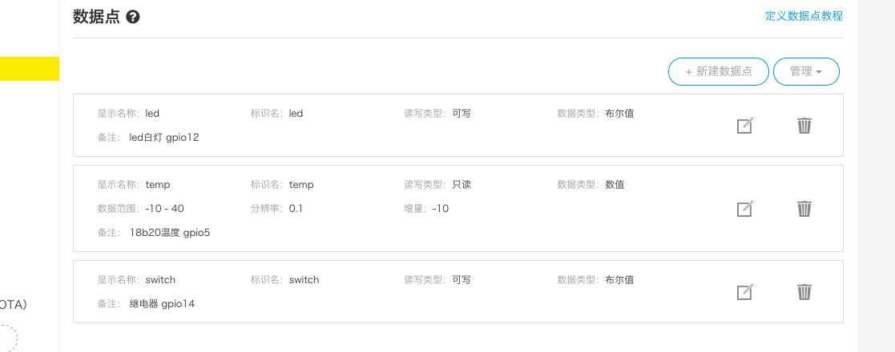

# GizAsst 基于机智云的ESP8266-12F SOC方案
### 包含 1颗LED 1个继电器  1个 DS18B20温度传感器
### 都是低电平触发。
### 数据点定义 和 GPIO接线 请看图




* 别忘了 gizwits_protocol.h 里面定义
```
/**@name Product Key (产品标识码)
* @{
*/
#define PRODUCT_KEY "xxxxxxxxxxxxxxxxxxxxxxx"
/**@} */
/**@name Product Secret (产品密钥)
* @{
*/
#define PRODUCT_SECRET "xxxxxxxxxxxxxxxxxxxxxxx"
```

* releases提供已编译好的固件